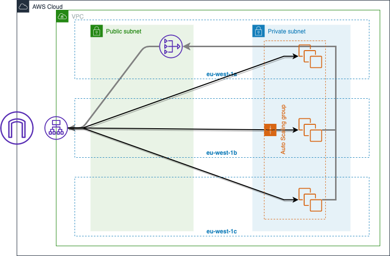

<h1 style="font-weight: bold;" align="center">AWS LAB</h1>

<h2 style="font-weight: bold;">Intro</h2>

Welcome to the AWS Infrastructure basics.  
This will guide you through the AWS web UI to learn the fundamental of this platform with the EC2 service.  
Follow it and create a simple infrastructure manually. This will get you familiar with the different parameters.

<h2 style="font-weight: bold;" align="right">Infrastructure schema</h2>

Here is a schema of what you will create in this lab.  

The infrastructure is composed by a VPC with multiple public and private subnets, an Internet and NAT gateway, an AutoScaling group with several EC2 with nginx installed and configured automatically.

You can improve this infrastructure by adding backend servers and a RDS database.

<h2 style="font-weight: bold;">Documentation</h2>

For more information about the different components of this infrastructure you can follow these links:

- [VPC](https://docs.aws.amazon.com/en_pv/vpc/latest/userguide/what-is-amazon-vpc.html)
- [Subnets](https://docs.aws.amazon.com/vpc/latest/userguide/VPC_Subnets.html)
  - Private
  - Public
- [Route tables](https://docs.aws.amazon.com/vpc/latest/userguide/VPC_Route_Tables.html)
- [Security Groups](https://docs.aws.amazon.com/vpc/latest/userguide/VPC_SecurityGroups.html)
- Gateways
  - [Internet](https://docs.aws.amazon.com/vpc/latest/userguide/VPC_Internet_Gateway.html)
  - [NAT](https://docs.aws.amazon.com/vpc/latest/userguide/vpc-nat-gateway.html)
- [Load Balancer](https://docs.aws.amazon.com/elasticloadbalancing/)
- [Autoscaling group](https://docs.aws.amazon.com/en_pv/autoscaling/plans/userguide/what-is-aws-auto-scaling.html)
- [EC2](https://docs.aws.amazon.com/en_pv/AWSEC2/latest/UserGuide/concepts.html)

