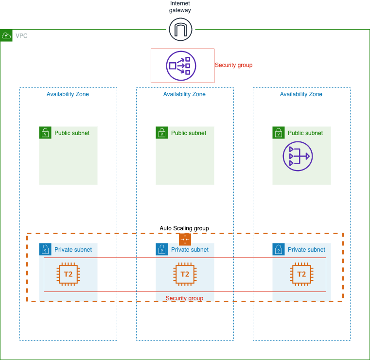

# Hands-On Basic Infrastructure on AWS

## Intro

Welcome to the AWS Infrastructure basics.  
This will guide you through the AWS web UI to learn the fundamental of this platform with the EC2 service.  
Follow it and create a simple infrastructure manually. This will gets you familiar with the different parameters.

<!-- [link](http://handson-d2si.s3-website-eu-west-1.amazonaws.com/basic-aws-infrastructure/#/) -->

## Infrastructure schema

First thing first !  
This is a schema of what you will create throught this hands-on.  

Details:

- 1 VPC
- 2 Public subnets
- 2 Private subnets
- 1 Internet Gateway
- 1 Nat Gateway
- Security Groups
- 1 Load Balancer
- 1 Autoscaling group

## Documentation

Remember for more information on the different components of this infrastructure you can follow these links:

- [VPC](https://docs.aws.amazon.com/en_pv/vpc/latest/userguide/what-is-amazon-vpc.html)
- [EC2](https://docs.aws.amazon.com/en_pv/AWSEC2/latest/UserGuide/concepts.html)
- [Autoscaling Group](https://docs.aws.amazon.com/en_pv/autoscaling/plans/userguide/what-is-aws-auto-scaling.html)

