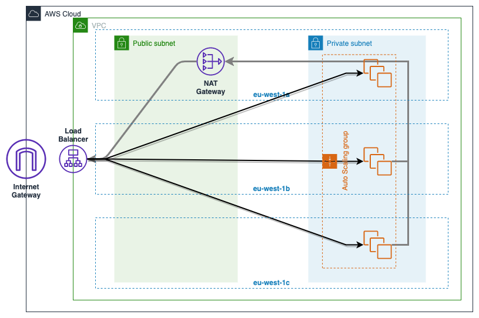

<h1 style="font-weight: bold;" align="center">AWS LAB</h1>

<h2 style="font-weight: bold;">Intro</h2>

Welcome to the AWS Infrastructure basics.  
This will guide you through the AWS web UI to learn the fundamental of this platform with the EC2 service.  
Follow it and create a simple infrastructure manually. This will gets you familiar with the different parameters.

<h2 style="font-weight: bold;">Infrastructure schema</h2>

First thing first!  

Here is a schema of what you will create throught this lab.  

Details:
- 1 VPC
- 2 Public subnets
- 2 Private subnets
- 1 Internet Gateway
- 1 Nat Gateway
- Security Groups
- 1 Load Balancer
- 1 Autoscaling group

<h2 style="font-weight: bold;">Documentation</h2>

Remember for more information about the different components of this infrastructure you can follow these links:

- [VPC](https://docs.aws.amazon.com/en_pv/vpc/latest/userguide/what-is-amazon-vpc.html)
- [EC2](https://docs.aws.amazon.com/en_pv/AWSEC2/latest/UserGuide/concepts.html)
- [Autoscaling Group](https://docs.aws.amazon.com/en_pv/autoscaling/plans/userguide/what-is-aws-auto-scaling.html)

